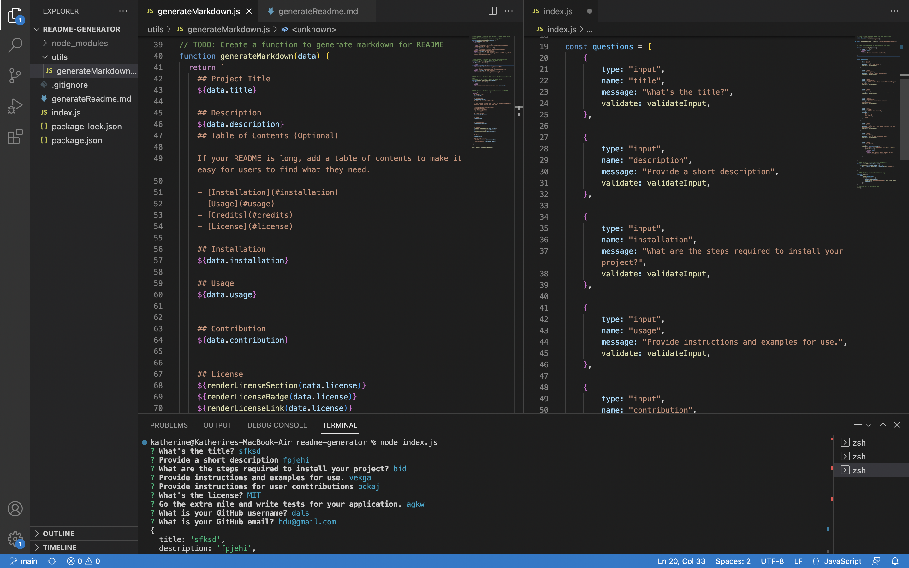

   ## Readme Generator

   ## Description
   I am trying to help people save more time on Readme. So I created a command-line application that dynamically generates a Readme file.
  
  ## Usage
    The system will prompt several questions to help users.
    
    According to the user's input, there should be a Readme generated.
   

   ## Contribution
    https://choosealicense.com/licenses/
    https://shields.io/category/license
    https://stackoverflow.com/questions/14494747/how-to-add-images-to-readme-md-on-github

   ## License
     CC-BY-SA-4.0

   
